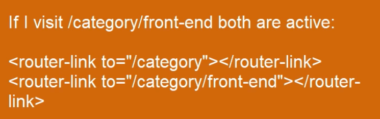

<!-- START doctoc generated TOC please keep comment here to allow auto update -->
<!-- DON'T EDIT THIS SECTION, INSTEAD RE-RUN doctoc TO UPDATE -->
**Table of Contents**  *generated with [DocToc](https://github.com/thlorenz/doctoc)*

- [Single Page Applications with Vue.js](#single-page-applications-with-vuejs)
  - [Environment Setup - Build Process](#environment-setup---build-process)
    - [Project Files](#project-files)
    - [Package Management](#package-management)
    - [Web Server](#web-server)
    - [Web Server - Index.html](#web-server---indexhtml)
    - [Webpack - Setup](#webpack---setup)
    - [Dev Middleware](#dev-middleware)
    - [Hot Reloading](#hot-reloading)
    - [Linting](#linting)
  - [Single File Components](#single-file-components)
    - [Vue Component](#vue-component)
    - [.Vue Files](#vue-files)
    - [ES6 Transpiling](#es6-transpiling)
    - [Styles](#styles)
    - [Template Binding](#template-binding)
    - [Child Components](#child-components)
    - [Custom Properties](#custom-properties)
    - [Slots](#slots)
    - [Scoped Styles](#scoped-styles)
    - [Extract Styles](#extract-styles)
  - [Routing](#routing)
    - [Loading Routes](#loading-routes)
    - [History Mode](#history-mode)
    - [Router link - Scroll behavior](#router-link---scroll-behavior)
    - [Redirect](#redirect)
    - [Route Parameters](#route-parameters)
    - [Route Query and Name](#route-query-and-name)
    - [Wildcard Route](#wildcard-route)

<!-- END doctoc generated TOC please keep comment here to allow auto update -->

# Single Page Applications with Vue.js

> Notes from Pluralsight [course](https://app.pluralsight.com/library/courses/vue-js-single-page-applications/table-of-contents)

## Environment Setup - Build Process

### Project Files

Project [src](https://github.com/bstavroulakis/vue-spa)


### Package Management

Use `npm init -y` to start a project accepting defaults.

Course is using this version of vue:

```shell
npm install vue@2.4.2 --save
```

### Web Server

This course will use express for both dev and production.


```shell
npm install express@4.15.4 --save
```

[server.js](server.js)

Start server:

```shell
nodemon server.js
```

Then visit [http://localhost:3000/](http://localhost:3000/)

### Web Server - Index.html

Use node's `fs` (file system) module to return `index.html` on any GET request.

Use npm scripts section to make shortcuts of commonly used commands.

### Webpack - Setup


For browsers, need a module bundler. For this course, will use Webpack as module bundler, and use various plugins to transpile, minify, and run other build processess.

[Base webpack config](build/webpack.base.config.js)

Specific version of webpack used for this course:

```shell
npm install webpack@3.5.5 --save-dev
```

Webpack file has a `config` json that includes all settings needed for webpack.

Webpack modules start with `entry`.

`output` sets path of generated output files (polyfilled code), to `dist` dir, which will be accessed via root path.
`[name]` will be filled in with `app` from `entry` section.

To run webpack:

```shell
node ./node_modules/webpack/bin/webpack --config ./build/webpack.base.config.js
```

To start using vue, import it in [src/app.js](src/app.js), initialize it, export it, then import app in [src/client-entry.js](src/client-entry.js).

Client entry mounts vue app into a dom element that must exist in index.html:

```javascript
app.$mount('#app');
```

Update [server.js](server.js) to use express static module to serve anything in dist dir.

### Dev Middleware

Inconvenient to have to restart web server on every change and re-run webpack build.

Install a few webpack plugins to make development more efficient:

```shell
npm install webpack-dev-middleware@1.12.0 webpack-hot-middleware@2.18.2 --save-dev
```

With dev middleware, dist files are not created on disk, but in memory. And only module that has changed will be rebuilt.
Hot middleware will reload only section that has changed in bundle.

Use the middleware in [build/dev-server.js](build/dev-server.js).

To be sure dist files are being loaded from memory, delete `dist` dir and run `npm start`. (no longer need separate step to run webpack build).

Notice output of webpack build, this time bundle is generated at `assets/js/app.js`, not `dist/assets/js/app.js`. Need to update script tag in index.html.

Now you can change module, for example string in app.js and webpack build will automatically re-run. Still need to refresh browser to see change.

### Hot Reloading

To start, introduce [build/webpack.client.config](build/webpack.client.config) and require the base config from within the client config. Then modify [build/dev-server.js](build/dev-server.js) to use client config instead of base config.

To make hot reloading work:

1. Extend client config adding a new entry point (dev-server)
2. Push two more plugins (dev-server)
3. Accept hot module in [src/client-entry.js](src/client-entry.js)
4. Add template definition in Vue instantiation [src/app.js](src/app.js) so that Vue can re-render template

Now can make a change to any module, then hot middleware through hot module replacement plugin injects changes, then vue knows how to render it.

### Linting

Will use ESLint. [.eslintrc.js](.eslintrc.js). To install the dev deps:

```shell
npm install eslint@4.5.0 eslint-loader@1.9.0 eslint-plugin-html@3.2.0 eslint-config-standard@10.2.1 eslint-plugin-promise@3.5.0 eslint-plugin-standard@3.0.1 eslint-plugin-import@2.7.0 eslint-plugin-node@5.1.1 --save-dev
```

Modify [build/webpack.base.config.js](build/webpack.base.config.js) to hook up linting into build process.

Now when server is restarted, build will fail on lint errors.

## Single File Components

Vue uses single file components, each file contains a template for html, a script for js and style for css.

### Vue Component

One way to do things is to declare a component using `Vue.component` method.

On first load, client entry will mount view instance to the div with id of `app` and create an `<app></app>` element.
`<app></app>` element is configured in app.js with a template, so `<app></app>` element will be replaced with app template configuration.

### .Vue Files

Recommended way of doing things. Example [src/theme/Layout.vue](src/theme/Layout.vue)

`<template>` section contains html of component.

import the .vue file in app.js

Need to add a webpack loader to load .vue files, add a new rule in `module` section of [build/webpack.base.config.js](build/webpack.base.config.js).

A few more dev dependencies needed to make this work:

```shell
npm install vue-loader@13.0.2 vue-template-compiler@2.4.2 --save-dev
```

Note that eslint can also lint .vue files so add that to the `test` property of the lint rule.

Now can remove this section from client-entry because vue-loader handles HMR:

```javascript
if (module.hot) {
  module.hot.accept()
}
```

Loader uses vue template compiler, so can remove `resolve` section from webpack base config that was compiling templates on the fly.

### ES6 Transpiling

From `console.log(AppLayout)` can see that it has `render` property.

Can use ES2015 spread syntax to replace this:

```javascript
const app = new Vue({
  render: h => h(AppLayout)
})
```

With this:

```javascript
const app = new Vue({
  ...AppLayout
})
```

Properties of AppLayout will `spread` to json properties that declare Vue instance.

Use Babel in case not all browsers support all features of ES2015/16.

Add babel loader test in rules section of webback base config.

Install babel loader and deps:

```shell
npm install babel-core@6.26.0 babel-eslint@7.2.3 babel-loader@7.1.2 babel-preset-es2015@6.24.1 babel-preset-stage-2@6.24.1 --save-dev
```

Update [.eslintrc.js](.eslintrc.js) to include babel eslint parser.

Finally configure babel with [.babelrc](.babelrc). This specifies for babel NOT to use modulesl because that's being handled by webpack.

### Styles

For this course, will use something smaller than Bootstrap, instead will use [Bulma](https://bulma.io/documentation/columns/basics/).

```shell
npm install bulma@0.5.1 --save
```

Then add `<style></style>` tag to [Layout.vue](src/theme/Layout.vue)

This tag accepts a lang attribute to indicate what to use to pre-process css (scss or stylus).
(same is true for script and template tags, for example could have `lang="coffee"` to use CoffeeScript).

For this course, will use sass `<style lang="scss">...</style>`.

Will need to add appropriate loader to webpack config to parse styles, and install deps:

```shell
npm install css-loader@0.28.5 sass-loader@6.0.6 node-sass@4.5.3 --save-dev
```

### Template Binding

Will be building a site containing a curation of the latest front end development resources. Eventually app will consume list of articles from a REST service. For now, hard-coded locally.

Start by adding `data` property to [Layout.vue](src/theme/Layout.vue)

Template section of .vue file has access to data from script via *data binding*.

Use `v-for` *directive* to iterate over a list of items:

```html
<div class="column is-one-third" v-for="(post, title) in posts" v-bind:key="post.id">
  <h3>{{ post.title }}</h3>
  {{ post.content }}
</div>
```

Can bind `href` attribute to data:

```html
<a class="card-footer-item" :href="post.link" target="_blank">Read More</a>
```

### Child Components

Layout.vue is getting too big having all the site's content. Break it up into *child components*.

[AppHeader.vue](src/theme/AppHeader.vue) | [AppFooter.vue](src/theme/AppFooter.vue)

Move header and footer sections of Layout.vue into Header and Footer components respectively.

Then need to include these new components in Layout.vue by importing them and defining them as components:

```javascript
<script>
  import AppHeader from './AppHeader.vue'
  import AppFooter from './AppFooter.vue'
  export default {
    components: {
      'app-header': AppHeader,
      'app-footer': AppFooter
    },
    data () {
      ...
    }
  }
```

Then using the custom elements in the template:

```html
<template>
  <div>
    <app-header></app-header>
    <section class="main-section section">
      ...
    </section>
    <app-footer></app-footer>
  </div>
</template>
```

Also pull out all the cards to a Category component.

### Custom Properties

In previous module, we created static child components. Want to create dynamic child components, pass in data to them.
One way to do this is with *custom properties*. Example [Post.vue](src/theme/Post.vue).

Use `props` property. This is an array that binds the property of the component with attribute of the element.


Move card snippet to Post component. Now it needs data passed in to it. This is done by binding the custom `<app-post>` element with the `post` json data, via `props`:

```html
<div class="column is-one-third" v-for="(post, title) in posts" v-bind:key="post.id">
  <app-post :post="post"></app-post>
</div>
```

### Slots

Passing in data via props is good enough for some cases, but may want more control over template of child component. Do this with slots. For example:

Remove post title from Post component and move it to Category component:

```html
<app-post :post="post">
  <h3>{{ post.title }}</h3>
</app-post>
```

At first, header will disappear from rendered page. Because Vue parsed the h3 title but doesn't know where to add it.

This can be specified with `<slot>` element in the child element `<app-post>`:

```html
<div class="card-content">
  <slot></slot>             <--- <h3> element from parent Category component will be "slotted" in here
  {{ post.content }}
</div>
```

But if also want to remove `{{ post.content }}` from Post element, need to bind multiple content areas with multiple slots.

To do this, in the child component, give each slot a name:

```html
<div class="card-content">
  <slot name="title"></slot>
  <slot name="content"></slot>
</div>
```

Then reference the content with the slot name in the parent component:

```html
<div class="column is-one-third" v-for="(post, title) in posts" v-bind:key="post.id">
  <app-post :post="post">
    <h3 slot="title">{{ post.title }}</h3>
    <span slot="content">{{ post.content }}</span>
  </app-post>
</div>
```

Finally, change Post component so only link is a property.

Benefit of using slots is component can be re-used but with different elements. For example, in another view cards could be used with an h2 tag instead of h3 for the title slot.

### Scoped Styles

For example, want to fix the card styling so they all have the same height.

Add `<style>` tag with following css Post.vue to fix this:

```css
.card {
  padding-bottom: 40px;
  height: 100%;
}

footer {
  position: absolute;
  bottom: 0;
  width: 100%;
  left: 0;
}
```

However, this breaks footer.

When style tag is added in Vue component, Vue adds it to `<head>` of html page. This means styles are included *globally*.

In the card example, `footer` style is intended to style only the `<footer>` element in the Post component. There is also a `<footer>` element in Layout component so the style unintentionally leaked out and affected the Layout component as well.

To fix this, add `scoped` attribute to style element: `<style scoped>`. Still adds style to head of document, but now it looks something like this:

```css
.card[data-v-8f18fd88] {
  padding-bottom: 40px;
  height: 100%;
}
footer[data-v-8f18fd88] {
  position: absolute;
  bottom: 0;
  width: 100%;
  left: 0;
}
```

And the corresponding data attribute is added to the card elements rendered by the Post component, so these styles only get applied to Post component.

### Extract Styles

So far, style tag has been used twice, in Layout component to define global rules, and in Post component to define scoped styles.
Having the style tag in the .vue file means as output of build, the styles are actually stored in the js bundle file. This is not good practice. Would like to have styles in a separate file, such as `styles.css`, which can be cached, cdn, etc.

Use extract styles module:

```bash
npm install extract-text-webpack-plugin@3.0.0 --save-dev
```

Add this plugin in [webpack.client.config.js](build/webpack.client.config.js).

To use it, need `extractCSS: true` in the css loader of webpack but don't want to add this to base config because later will have server side rendering and not want this. So add it to client config, modifying the rules:

```javascript
config.module.rules
  .filter(x => {return x.loader === 'vue-loader'})
  .forEach(x => x.options.extractCSS = true)
```

Finally, modify [index.html](index.html) to include the extracted css file:

```html
<link rel="stylesheet" href="/assets/styles.css">
```

## Routing

### Loading Routes

Use [vue-router](https://router.vuejs.org/en/), the official Vue.js plugin for routing. First install it:

```shell
npm install vue-router@2.7.0 --save
```

Vue plugins are scripts that can be used to extend functionality of Vue globally.

[router.js](src/router.js)

Recall in app.js, Layout component is mapped to the Vue app. This means every time a page is loaded, the Layout.vue component is loaded.

Router is exported, then imported into app.js. To use it, extend the Vue instance with the Router instance.

After router is configured to have default path point to Category component, this component can be removed from Layout component and replaced with `<router-view></router-view>` reserved element:

```html
<div class="container content">
  <router-view></router-view>
</div>
```

Every time page is loaded, router will determine current path, load component linked to path and add its template in the `<router-view>` section.

### History Mode

Adding [Login.vue](src/theme/Login.vue) and a router path to load it.

Now can get to login page via [http://localhost:3000/#/login](http://localhost:3000/#/login).

Clicking logo image reloads root path:

```html
<a href="/">
  
</a>
```

Which goes to [http://localhost:3000/#/](http://localhost:3000/#/)

All these paths have a hash symbol `#` between domain and path.

Can also manage history with javascript via history api, to push pages into history.
To enable this, set `mode: history` in router options. Then navigation works without the hash.

Note that clicking the logo reloads the full page. Next will learn how to ensure that only the router-view is reloaded.

### Router link - Scroll behavior

When loading a new page, should only load component that is linked to the matching path in the router view area.

Use `<router-link>` reserved element, instead of `<a>`.
Instead of `href` attribute, use `to` attribute.

```html
<router-link to="/"></router-link>
```

Whenever a link is selected, router adds a css class `router-link-exact-active`. But in Bulma UI library, active link is set with `is-active` class. Can configure this class as part of Vue router options.

This works for styling Login link. But home link always seems to have `is-active` even if it is not.
This is because active class matching is *inclusive*. Looks for link that starts with `to` attribute value.



It works this way because if there's children such as `/category` and `/category/front-end`, it always has parent selected as well.

But this is an issue for home route path. To fix this, add `exact` attribute to home `<router-link>` element.

`scrollBehavior` is a property of router, a method that accepts path navigating to, path coming from, and scroll position that page was in. Can set for example, y to 0, to make every page navigation scroll to top.

Can also return last saved scroll position to maintain uses position across transitions:

```javascript
scrollBehavior (to, from, savedPosition) {
  if (savedPosition) {
    return savedPosition
  }
}
```

If link has hash parameter, can return hash selector to scroll to the element with id of hash value:

```javascript
scrollBehavior (to, from, savedPosition) {
  if (to.hash) {
    return {
      selector: to.hash
    }
  }
}
```

### Redirect

Would like category component to load with a category path like `http://localhost:3000/category/<category-name>`, and not with root path.

To start, change router path for Category component:

```javascript
{path: '/category/front-end', component: Category}
```

Modify index.html, add `/` in front of stylesheet to load assets from root path (also need that for js assets)

To have home route redirect to category, add to router:

```javascript
{path: '/', redirect: '/category/front-end'}
```

### Route Parameters

Sample app has multiple categories, for example `front-end`, `mobile`, etc. Use *route parameters* for dynamic routing, i.e. instead of specifying each category:

```javascript
{path: '/category/front-end', name: 'category', component: Category},
{path: '/category/mobile', name: 'category', component: Category},
```

Use `:parameterName` syntax:

```javascript
{path: '/category/:id', name: 'category', component: Category},
```

To use this route from a template:

```html
<router-link class="nav-item is-tab" to="/category/front-end" exact>Front-end</router-link>
<router-link class="nav-item is-tab" to="/category/mobile" exact>Mobile</router-link>
```

Now want the Category component to know about `:id` parameter in the route.

In the data function, add an `id` property. Vue exposes router to components via `$router` object:

```javascript
id: this.$route.params.id
```

Component can use router object to programmatically navigate to another page `this.$route.push('/')` or determine what parameters are in the current route `this.$route.params`.

Now to make use of route parameter, break up posts into two arrays, for front end and mobile (still hard-coded data for now).

Add `methods` section with function `loadPosts`, which checks the category `id` and sets the `posts` property accordingly.

Then run the loadPosts method whenever component is `created()`

ISSUE: `created()` is only invoked first time component is loaded. Later if the route changes to a different id but same component, `created()` will NOT be run again. Therefore loading data dynamically based on route parameters should not be placed in created method.

Solution for now is to add watcher on `$route` object, which receives current and previous state of object, and re-run `loadPosts` when the watcher is invoked.

### Route Query and Name

Also want access to query parameters, for example `http://localhost:3000?sortBy=name&page=1&order=asc`.

For example, to introduce pagination on Category component, navigate to `http://localhost:3000/category/front-end?page=1`.

Then can access it in the Component script with `this.$route.query.page`.

However, need to remove `exact` attribute from `<router-link>` element in AppHeader.vue because want the links to show as active even when there are query parameters.

To organize routes and have semantic access, use `name` parameter in router configuration, for example: `{path: '/category/:id', name: 'category', component: Category},`

Now, instead of hard-coding path in `<router-link>` elements in AppHeader.vue, can reference them by name, and pass in parameters as a json object: `<router-link class="nav-item is-tab" to="{name: 'category', params: {id: 'mobile'}}">Mobile</router-link>`

However, now clicking on Mobile link in app, this shows up in url: `http://localhost:3000/category/%7Bname:%20'category',%20params:%20%7Bid:%20'mobile'%7D%7D`

The json got encoded and placed in url. To fix this, put `:` in front of `to` attribute of `<router-link>`: `<router-link class="nav-item is-tab" :to="{name: 'category', params: {id: 'mobile'}}">Mobile</router-link>`

Now Vue can parse the section rather than adding it as a string to url.

### Wildcard Route

For example, to create 404 page for all paths that aren't explicitly handled, use wildcard route, linking it to any component you wish, in this example, [NotFound](src/theme/NotFound.vue) which simply displays an error message:

```javascript
{path: '*', component: NotFound}
```
